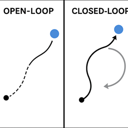
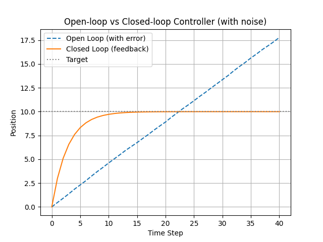
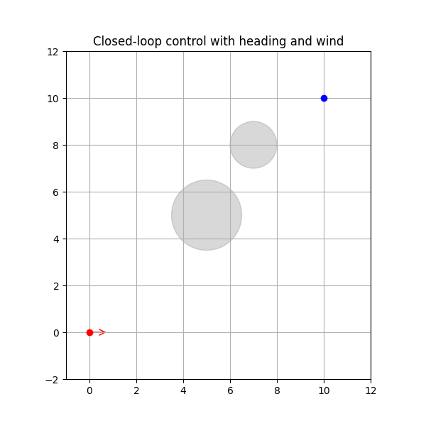

# Open-Loop vs Closed-Loop Robotic Control Examples

This repository contains a series of Python examples demonstrating the difference between **open-loop** and **closed-loop** control strategies applied to a simple 2D robot navigation task. The examples progressively build up to include **heading control, obstacle avoidance, wind disturbances**, and practical fixes for common challenges like local minima and oscillations.

---

## Table of Contents

- [Overview](#overview)
- [Examples](#examples)
  - [1. Basic Open-Loop vs Closed-Loop (No Obstacles)](#1-basic-open-loop-vs-closed-loop-no-obstacles)
  - [2. Closed-Loop with Obstacles — Infinite Spinning Issue](#2-closed-loop-with-obstacles--infinite-spinning-issue)
  - [3. Improved Closed-Loop with Obstacle Avoidance and Goal Stabilization](#3-improved-closed-loop-with-obstacle-avoidance-and-goal-stabilization)
- [Env Setup](#env-setup)
- [Usage](#usage)

---

## Overview

Control systems are essential for robotic navigation.  
- **Open-Loop Control:** Executes a planned sequence of movements without feedback.  
- **Closed-Loop Control:** Continuously adjusts actions based on sensor feedback.

This repo illustrates these concepts with simple 2D simulations. We show how closed-loop control helps robots adapt to disturbances (like wind) and avoid obstacles but can face challenges such as local minima, requiring thoughtful design fixes.

---

## Examples

### 1. Basic Open-Loop vs Closed-Loop (No Obstacles)

- The robot tries to move from start to target over a fixed number of steps.  
- **Open-loop:** Follows a fixed path without correction.  
- **Closed-loop:** Uses feedback to correct its trajectory.  
- **Outcome:** Closed-loop adapts better to noise and disturbances.

**Animation:**  


---

### 2. Closed-Loop with Obstacles — Infinite Spinning Issue

- Introduces static circular obstacles.  
- The robot uses a potential-field-based method combining attraction to target and repulsion from obstacles.  
- **Problem:** The robot avoids obstacles but gets stuck circling near the target due to local minima in the potential field.

**Animation:**  


---

### 3. Improved Closed-Loop with Obstacle Avoidance and Goal Stabilization

- Adds a “snap-to-goal” override that slows velocity near the target and clamps movements to avoid overshoot.  
- Balances obstacle avoidance with stable arrival at the target, even under wind disturbance.  
- **Result:** The robot successfully avoids obstacles *and* settles near the target without oscillation.

**Animation:**  


---

## Env Setup

```bash
git clone https://github.com/marino-multipla/open-closed-loop-controller.git
cd open-closed-loop-controller
conda create -n open-closed-loop python=3.10
conda activate open-closed-loop
pip install matplotlib
```

## Usage
You will find some example of open-closed loop comparison and some example of close-loop with collision avoidance, infinite spinning issues. Run the one that you like.

```bash
python open_closed_loop_example_1.py
```

```bash
python closed_loop_example_7.py
```


